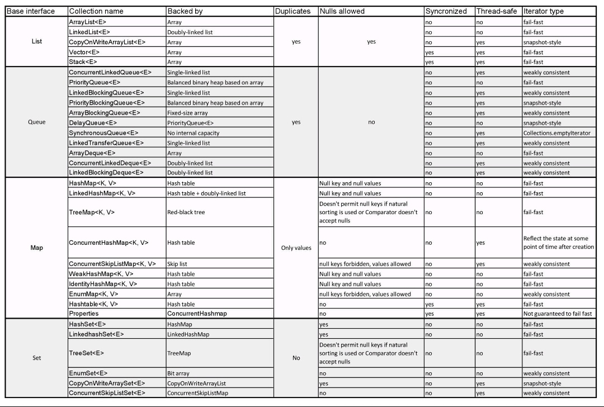

# java-collections-framework

| Base Interface  | Collection name  | Backed by      | Duplicates      | Syncronized     | Thread safe     | Iterator type
| --------------- | --------------- | --------------- | --------------- | --------------- | --------------- | --------------- |
|List|||
|| ArrayList<E> | Array| yes | yes | no | no | fail-fast |
|| LinkedList<E> |  Double-linked list| yes | yes | no | no | fail-fast |
|| CopyOnWriteArrayList<E> |  Array| yes | yes | no | yes | snapshat-style |
|| Vector<E> |  Array| yes | yes | yes | yes | fail-fast |
|| Stack<E> | Array| yes | yes | yes | yes | fail-fast |
|Queue||
|| ConcurrentLinkedQueue<E> | Single-linked list| yes | no | no | yes | weakly consistent |
|| PriorityQueue<E> | Balanced binary heap based on array| yes | no | no | no | fail-fast |
|| LinkedBlockingQueue<E> | Single-linked list| yes | no | no |yes | weakly consistent |
|| PriorityBlockingQueue<E> | Balanced binary heap based on array | yes | no | no |yes | snapshat-style |
|| ArrayBlockingQueue<E> | Fixed-size array| yes | no | no |yes |weakly consistent |
|| DelayQueue<E> | PriorityQueue<E>| yes | no | no |yes | snapshat-style |
|| SynchronousQueue<E> | No internal capacity| yes | no | no | no | Collections.emptyIterator |
|| LinkedTransferQueue<E> | Single-linked list| yes | no | no |yes | weakly consistent |
|| ArrayDeque<E> | Array | yes | no | no | no |fail-fast |
|| ConcurrentLinkedDeque<E> | Double-linked list | yes | no |  no | weakly consistent |
|| LinkedBlockingDeque<E> | Double-linked list | yes | no | no | weakly consistent |
| Map | | 
|| HashMap<K,V> | Hash table | Only values | Null key and null values | no | fail-fast |
|| LinkedHashmap<K,V> | Hash table + doubly-linked list | Only values | | Null key and null values | no | fail-fast |
|| TreeMap<K,V> | Red-black tree | Only values | Doesnt permit null keys if natural sorting is used or Comparator doesnt accept nulls | no | fail-fast |
|| ConcurrentHashMap<K,V> | Hash table | Only values | no | no |  Reflect the state at some point of time after creation |
|| ConcurrentSkipListMap<K,V> | Skip list | Only values | Null keys forbidden but values allowed | no | weakly consistent |
|| WeakHashMap<K,V> | Hash table| Only values | Null key and null values | no | fail-fast |
|| IdentityHashMap<K,V> | Hash table | Only values | Null key and null values | no | fail-fast |
|| EnumMap<K,V> | Array | Only values | Null keys forbidden but values allowed | no | weakly consistent |
|| Hashtable<K,V> |  Hash table| Only values | no | yes | fail-fast |
|| Properties | ConcurrentHashMap<K,V> | Only values |no | yes | not guaranteeed to fail-fast |
|Set||
|| HashSet<E> |  HashMap|  No | yes | no | fail-fast |
|| LinkedHashSet<E> | LinkedHashMap| No | yes | no | fail-fast |
|| TreeSet<E> | TreeMap| No | Doesnt permit null keys if natural sorting is used or Comparator doesnt accept nulls no |  fail-fast| 
|| EnumSet<E> | Bit array| No | No | no |  weakly consistent |
|| CopyOneWriteArraySet<E > | CopyOnWriteArrayList| No | yes | no | snapshot-style |
|| ConcurrentSkipListSet<E> | ConcurentSkipListMap| No | No  | no | weakly consistent |

